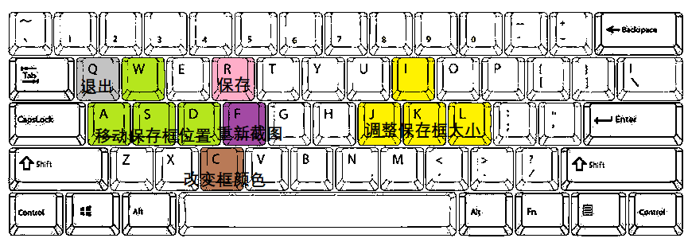

# 钉钉自动群接龙使用指南*（电脑端）*

###### *本程序仅适用于windows系统电脑*

1、配置接龙程序

​	(1)打开**timetable.txt**你会看见以下结构

```
7:10
7:50
9:5
10:20
12:50
14:5
15:20
```

​	(2)**timetable.txt**结构解析

​		 |—第一行至以下所有：接龙的时间点

​	(3)关键时间点填写规范

​		时间点填写格式如下：

```
小时:分钟
```

​		这里一切字符都应当使用英文输入法状态下的符号，使用违规字符会导致报错。

​		文件中除第一行外，在行中任意位置输入**#**号，本行时间点将不会被执行。

​		小时与分钟内可以选择带"0"或不带"0"，随你喜好。

​		这里的关键时间是指开始搜寻打卡的时间，**距离打卡成功还有10s左右的操作时间**，有搜寻上限（默认25次滚动屏幕），请充分估计时间。**

​		文件中所有空格与缩进在执行时均会被无视，可以放心缩进，使用更优美的表达方式。

​	(4)运行*get_img.py*以更新目标图像**（强烈建议）**



​		键位功能如下：(英文小写状态输入)

​		wasd:移动保存框的位置

​		ijkl:改变保存框的大小( **j**横向减小, **l**横向增大, **i**纵向减小, **k**纵向增大)

​		q:退出程序

​		c:改变保存框的颜色*（目前只支持黑或白显示）*

​		f:重新截取图像*（窗口会暂时关闭，在完成截图后会重新打开）*

​		r:保存保存框中的图像作为目标图像

2、使用接龙程序

​	运行*auto.py*，并将钉钉窗口置于最顶层，鼠标位于聊天区域中。

3、开发者注意事项：

​	使用了OpenCV图像近似算法，因此当显示器分辨率变化时，最好重做目标图像。

​	建议使用我们的图像截取程序，因为图像的大小也与识别结果有关*（程序中对截屏进行了缩放）*

​	有需要的可自行用pyinstaller打包，我这里打包一直报win32api的错（可能是PIL用win32api截的图）
